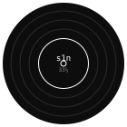

<table>
<tr>
<td width="130" align="center">



</td>
<td>

**VADYM DUBINKIN**
"shipping, since 2021"


```
label     s1n recordings
cat. no   SC-2026
format    remote-only, 33⅓ rpm
```

</td>
</tr>
</table>

──────────────────────────────────────────

**NOW PLAYING**


`building devflow ai — an ai workspace with rag over your own codebase`

──────────────────────────────────────────

```
SIDE A

01. react · next.js · typescript
02. node.js · express · postgres
03. aws · docker · ci/cd
04. openai api · langchain · rag

SIDE B

01. 5+ years shipping saas products, end to end
02. now building devflow ai — rag over your own codebase
03. kyiv, ukraine — remote only
```

──────────────────────────────────────────

<sub>produced & engineered by vadym dubinkin · kyiv, ua</sub>

booking: [linkedin](https://www.linkedin.com/in/vadym-dubinkin-dev/) · [vadymdevv@gmail.com](mailto:vadymdevv@gmail.com)
